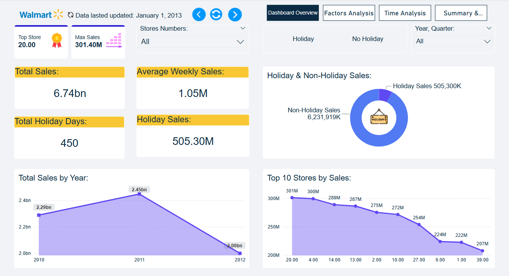
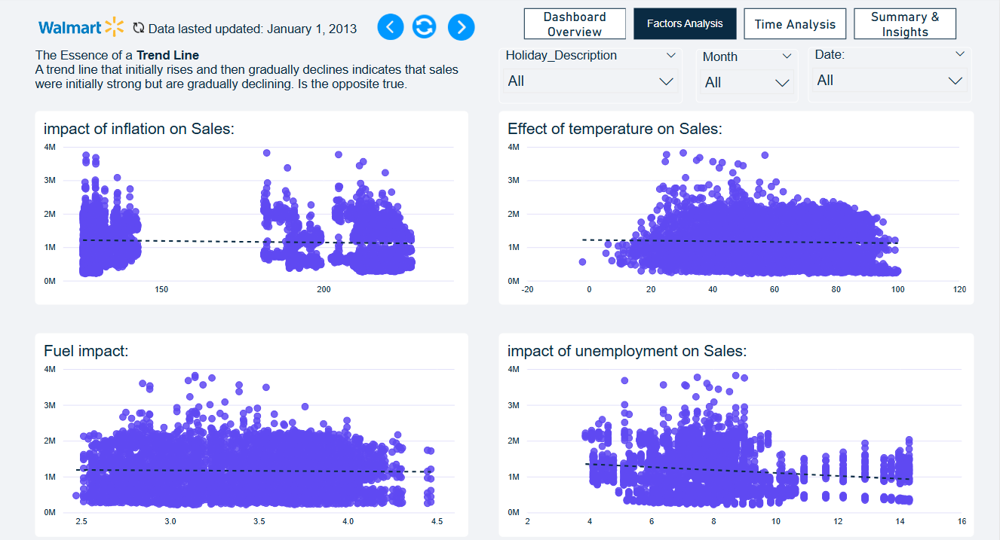
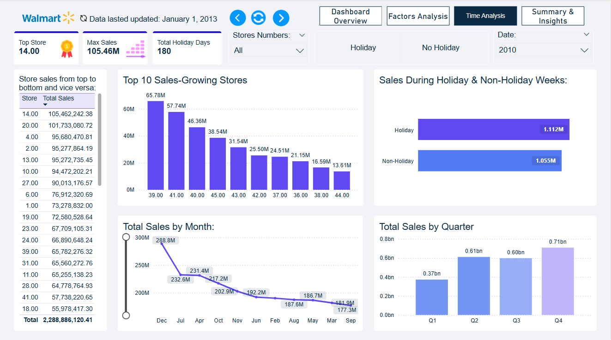
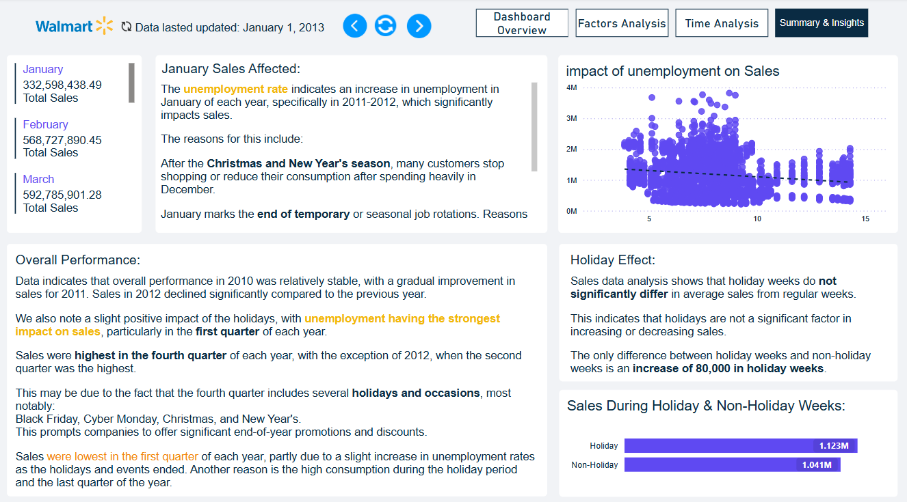

# 📊 Walmart Sales Analysis

## 📌 Project Overview

This project provides a comprehensive analysis of Walmart sales data using **Power BI**, with a focus on understanding the key factors that influence weekly sales performance — including:

- 🟠 Temperature  
- 🔵 Unemployment Rate  
- 🟢 Public Holidays  
- 🟣 Fuel Prices

---

## 🎯 Objectives

- Analyze weekly sales performance across all Walmart stores.
- Identify the impact of holidays, fuel prices, temperature, CPI, and unemployment on sales.
- Compare sales during holiday weeks vs. non-holiday weeks.
- Discover trends and seasonal patterns to support better decision-making.
- Provide actionable insights for planning promotions and optimizing inventory.

---

## 🛠️ Tools Used
- Microsoft Power BI
- Excel/CSV Dataset (Imported from Kaggle)

---

## 🧾 Attached Files
- `Walmart_Sales_Analysis.pbix` - Power BI report file.
- `Walmart_Weekly_Sales.csv` - The raw dataset used for the analysis.
- `dashboard.png` - A screenshot of the final dashboard.

---

## 🧠 Analysis Summary
The dashboard highlights how external factors affect sales trends over different weeks and holidays.

Key insights also help improve promotion planning, operations, and inventory management.

---

## 📸 Dashboard Preview

### 🟢 Overall Performance

### 🔵 Factor Analysis

### 🟡 Time Sales Trends

### 🟣 Summary & Insights

---
